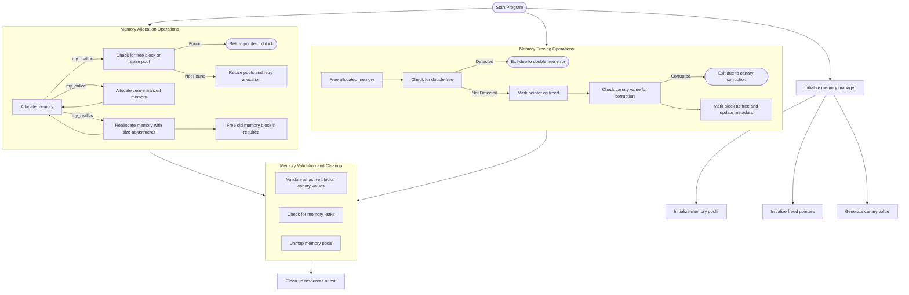

# Description

Custom malloc(), calloc(), realloc() and free(). With features such as double-free detection, buffer overflow prevention, and memory leak checks.

# Features

* Custom Memory Management: Efficient allocation, reallocation, and deallocation tailored to specific needs.
* Security Enhancements:
  * Canary values to detect heap overflows.
  * Double-free detection to prevent misuse.
  * Automatic zeroing of freed memory blocks.
* Leak Detection: Identifies and reports memory leaks on program exit.
* Extensible Logging: Logs memory operations when enabled via the MSM_OUTPUT environment variable.
* Memory Pool Resizing: Dynamically grows memory pools to accommodate larger allocations.

# Architecture



# Build

```bash
git clone https://github.com/yourusername/secmalloc.git
cd secmalloc/example
make
```

# Makefile

```Makefile
Usage: make <target>
Targets:
  all           Build both dynamic and static libraries
  dynamic       Build the dynamic library (.so)
  static        Build the static library (.a)
  test          Build and run unit tests
  clean         Remove object files and temporary files
  distclean     Clean up all built files and libraries
  build_test    Build the test executable
  help          Display this help message
```

# Usage

```bash
LD_PRELOAD=./libmy_secmalloc.so ls
```

# Unit Test

Made with [Criterion](https://github.com/Snaipe/Criterion).

* Memory Allocation: Validates my_malloc for zero-size, small-size, large-size, and multiple allocations.
* Zero Initialization: Ensures my_calloc correctly zeroes out memory.
* Reallocation: Verifies behavior of my_realloc for resizing and pointer reuse.
* Freeing Memory: Checks proper deallocation and reuse of memory blocks.
* Double-Free Detection: Tests the library's ability to detect and handle double-free errors.
* Buffer Overflow Detection: Simulates canary value corruption to ensure buffer overflows are caught.
* Memory Leak Detection: Tests the detection of unfreed memory at program exit.

```bash
make test
```

# Authors

* [Itayon](https://github.com/Itayon)
* [MikeHorn-git](https://github.com/MikeHorn-git)
